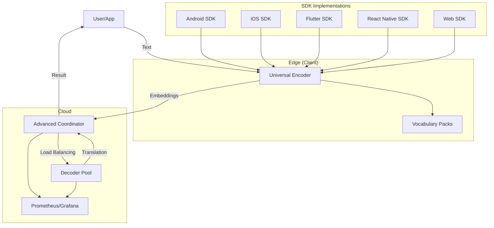
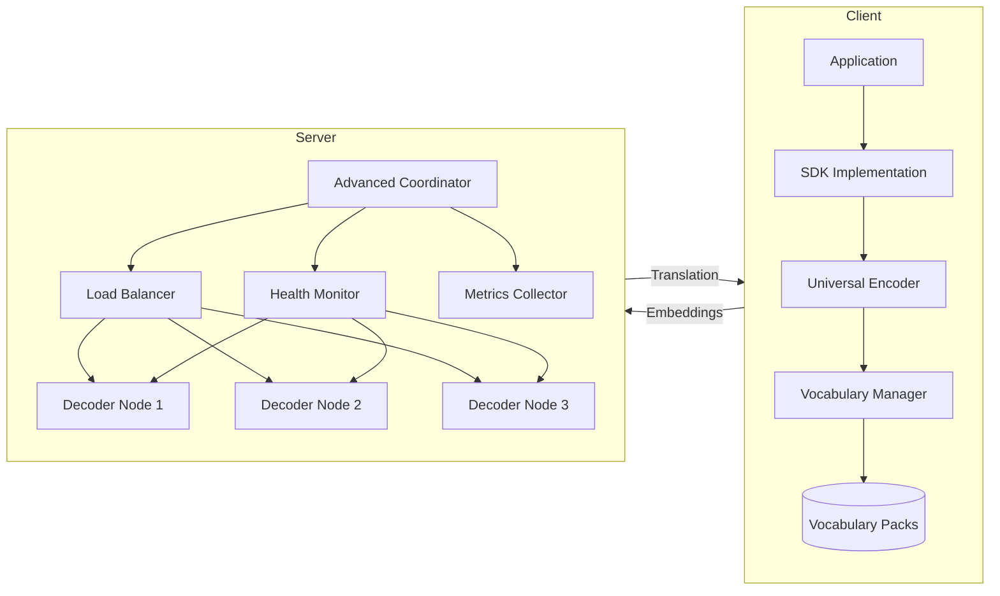

# System Architecture

## Overview

The Universal Translation System uses a split architecture to minimize client size while maximizing translation quality and performance.

## Interactive Architecture Diagram



## Component Relationships



## Components

### 1. Universal Encoder (Edge/Client)
- **Platforms:** Android, iOS, Flutter, React Native, Web
- **Implementation:**
  - Android/iOS/Flutter: Native C++ core via FFI (libuniversal_encoder)
  - React Native/Web: API-based encoding (optionally native in future)
- **Vocabulary:** Dynamic loading (2-4MB per language pack)
- **Output:** Compressed embeddings (2-3KB per translation)

### 2. Vocabulary Packs
- **Latin Pack:** ~3MB (covers 12 languages)
- **CJK Pack:** ~4MB (Chinese, Japanese, Korean)
- **Other Packs:** 1-2MB each

### 3. Universal Decoder (Cloud)
- **Implementation:** PyTorch, served via Litserve (2x faster than FastAPI)
- **Architecture:** 6-layer transformer with cross-attention
- **Infrastructure:** Runs on GPU servers (T4, 3090, V100, A100)
- **Deployment:** Docker, Kubernetes, supports horizontal/vertical scaling

### 4. Advanced Coordinator
- **Role:** Manages communication between multiple edge encoders and a dynamic pool of cloud decoders
- **Features:**
  - Least-loaded load balancing (routes requests to the decoder with the lowest current load)
  - Dynamic decoder pool: add/remove decoders at runtime via REST API or dashboard, no downtime
  - Health checks: background thread checks each decoder’s `/health` endpoint
  - Prometheus metrics: exposes coordinator and decoder pool metrics for monitoring
  - Authentication: token-based for admin endpoints and dashboard actions
  - Web UI: dashboard for monitoring, manual routing, and node management
  - **Enhanced Dashboard:**
    - Authentication UI for admin actions
    - Real-time charts (load, uptime) using Chart.js
    - Advanced analytics: uptime, request rates, error rates, per-decoder stats
    - Manual routing for authenticated users
- **How it works:**
  - Encoders send requests to the coordinator’s `/decode` endpoint
  - Coordinator selects the least-loaded healthy decoder and proxies the request
  - Decoders can be added/removed at any time; the system automatically adjusts
  - All activity and health is visible in the dashboard and via Prometheus

## Data Flow

1. User inputs text
2. App loads relevant vocabulary pack (if needed)
3. Encoder converts text → embeddings (on device or via API)
4. Embeddings compressed and sent to coordinator `/decode` endpoint
5. Coordinator load-balances and proxies to a healthy decoder
6. Decoder generates translation (Litserve endpoint)
7. Translation sent back to app

## SDK Alignment Table

| SDK           | Edge Encoding | Cloud Decoding | Native/FFI | API-based | Aligned? |
|---------------|--------------|---------------|------------|-----------|----------|
| Android/iOS   | Yes          | Yes           | Yes        | Yes       | Yes      |
| Flutter       | Yes          | Yes           | Yes        | Yes       | Yes      |
| React Native  | No           | Yes           | No         | Yes       | Yes      |
| Web           | No           | Yes           | No         | Yes       | Yes      |

## Key Design Decisions

- **Split Architecture:** Small client, heavy compute on server
- **Universal Encoder:** One encoder, dynamic vocab, zero-shot
- **Litserve for Inference:** Fast, production-grade AI serving
- **Advanced Coordinator:** Scalable, dynamic, observable, and secure routing for all decoders
- **CI/CD:** Automated builds for encoder/decoder, artifact storage
- **Config Auto-Detection:** Training scripts auto-select best config for detected GPU

## Configuration Management

The Universal Translation System uses a comprehensive configuration management system to ensure consistency, reliability, and ease of use.

### Configuration Structure

Configurations are stored in YAML or JSON format and include the following sections:

- **Version:** Configuration version for tracking changes
- **Training:** Parameters for model training (batch size, learning rate, etc.)
- **Model:** Model architecture parameters (dimensions, layers, etc.)
- **Deployment:** Deployment-specific settings (Docker, Kubernetes, local)
- **Monitoring:** Monitoring configuration (Prometheus, Grafana)
- **Logging:** Logging configuration (level, rotation, etc.)

### Configuration Tools

The system provides several tools for managing configurations:

1. **Configuration Wizard (`scripts/config_wizard.py`):**
   - Interactive wizard for creating new configurations
   - Detects hardware capabilities and suggests optimal settings
   - Validates configurations as they are created

2. **Configuration Validator (`scripts/validate_config.py`):**
   - Validates configurations against schemas
   - Checks for file and directory references
   - Verifies internal consistency
   - Suggests improvements
   - Checks GPU compatibility

3. **Auto-Detection:**
   - Training scripts automatically detect hardware and select the best configuration
   - Supports various GPU types (A100, V100, RTX series, etc.)
   - Adjusts batch size, precision, and other parameters based on available resources

### Configuration Best Practices

1. **Use the Wizard for New Configurations:**
   ```bash
   python scripts/config_wizard.py
   ```

2. **Validate Configurations Before Use:**
   ```bash
   python scripts/validate_config.py config/my_config.yaml --check-references --check-consistency --suggest-improvements
   ```

3. **Use Environment-Specific Configurations:**
   - `config/training_cpu.yaml` for CPU-only environments
   - `config/training_v100.yaml` for V100 GPUs
   - `config/training_rtx3090.yaml` for RTX 3090 GPUs

4. **Override with Command-Line Arguments:**
   ```bash
   python main.py train --config config/training_v100.yaml --batch-size 32 --learning-rate 1e-4
   ```

## Directory Structure
(see project root for up-to-date structure)