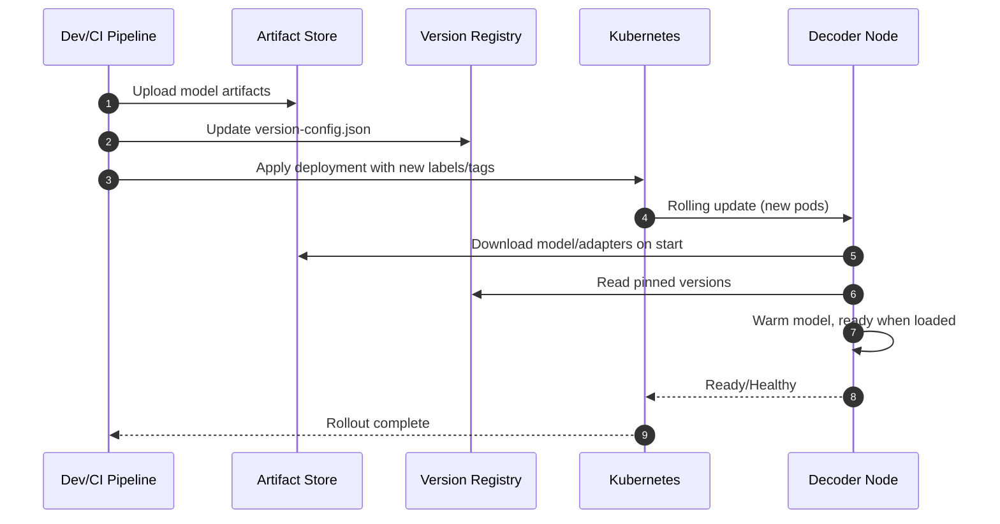
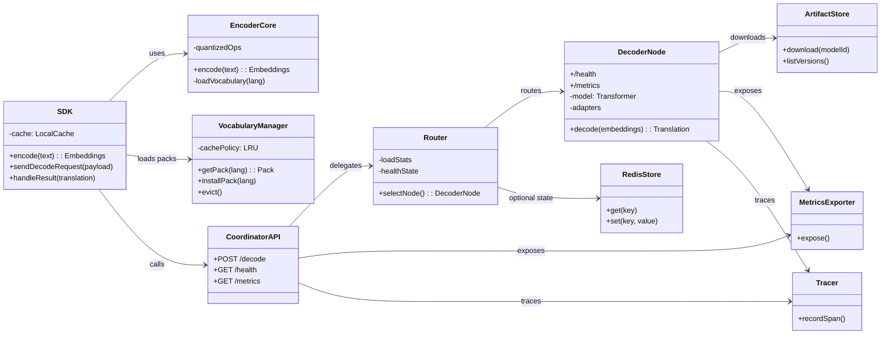

# System Architecture

## Table of Contents
- [Overview](#overview)
- [End‑to‑End Architecture Diagram](#end-to-end-architecture-diagram)
- [Components (In Depth)](#components-in-depth)
- [Data Flow (Detailed)](#data-flow-detailed)
- [Deployment & Scaling](#deployment--scaling)
- [Security](#security)
- [Configuration & Versioning](#configuration--versioning)
- [Ports & Endpoints](#ports--endpoints)
- [Failure Handling & Reliability](#failure-handling--reliability)
- [Repository Mapping](#repository-mapping)
- [Sequence Diagrams](#sequence-diagrams)
- [Component-Level Diagram (Modules & Interfaces)](#component-level-diagram-modules--interfaces)
- [Deployment Diagram (Kubernetes Topology)](#deployment-diagram-kubernetes-topology)
- [Related Documentation](#related-documentation)
- [Notes](#notes)

## Overview

The Universal Translation System is an edge–cloud platform designed to keep client apps small while delivering high‑quality, scalable translations. Text is encoded on device into compact embeddings and decoded in the cloud by GPU‑powered decoder nodes. A coordinator handles routing, health checks, load balancing, security, and observability. Supporting systems include vocabulary management, artifact/model storage, CI/CD, monitoring, and Kubernetes orchestration.

---

## End‑to‑End Architecture Diagram

---

## Components (In Depth)

### 1) SDKs and Edge Encoder
- **Platforms:** Android, iOS, Flutter, React Native, Web (WASM optional).
- **Encoder Core:** C++ implementation for native platforms with FFI bindings; TypeScript + WASM for the web.
- **Vocabulary System:**
  - Packs of 2–4MB per language (Latin ~3MB, CJK ~4MB, etc.).
  - Dynamic download on demand; cached locally with versioning; LRU for memory efficiency.
- **Output Payload:** Embeddings serialized via MsgPack and compressed with LZ4 to minimize bandwidth.
- **Fallbacks:** SDKs can fall back to cloud‑only encoding if local edge encoding is unavailable.

### 2) Coordinator (Control Plane)
- **Routing:** Least‑loaded healthy node selection with active and passive health probes.
- **Security:** JWT auth for protected endpoints and admin operations; optional HTTPS offload in front of the coordinator.
- **Reliability:** Rate limiter and circuit breaker patterns to protect downstream decoders.
- **Observability:** Exposes Prometheus metrics; integrates with OpenTelemetry for tracing.
- **Dashboard:** Real‑time charts (Chart.js) for node health, throughput, and error rates.
- **Redis (optional):** Shared state for distributed coordination or rate limiting.

### 3) Decoder Nodes (Data Plane)
- **Serving:** Litserve (faster than FastAPI for high‑throughput ML inference) hosting PyTorch models.
- **Model Architecture:** 6‑layer transformer with cross‑attention; supports dynamic adapter loading per language/domain.
- **GPU Acceleration:** Targets GPUs like T4, 3090, V100, A100; memory‑optimized for multi‑concurrency.
- **Health & Metrics:** Each node publishes `/health` and `/metrics` endpoints; autoscaling driven via metrics in K8s.

### 4) Artifacts & Models
- **Locations:** `models/` for local dev; production models fetched by nodes from a model/artifact store.
- **Versioning:** `version-config.json` and scripts coordinate version pins and rollouts.
- **Publishing:** `scripts/upload_artifacts.py` and CI pipelines push artifacts to remote storage.

### 5) Observability
- **Metrics:** Prometheus scrapes coordinator and decoder nodes; dashboards live in `monitoring/grafana/dashboards`.
- **Tracing:** Optional OpenTelemetry integration for end‑to‑end latency analysis.
- **System Metrics:** GPU/CPU/Memory via `GPUtil`, `psutil`; overall health tracked and alerting configured.

### 6) CI/CD & Infrastructure
- **Build:** `scripts/build_models.py`, `scripts/pipeline.py`, and platform‑specific build scripts.
- **Docker:** Dockerfiles under `docker/`; multi‑stage builds for slim images.
- **Kubernetes:** Manifests in `kubernetes/` define services, deployments, probes, and autoscaling policy.
- **Release:** `scripts/release.ps1/.sh` and CI workflows publish SDKs and backend services.

---

## Data Flow (Detailed)

1. The client loads the necessary vocabulary pack(s) if not cached (managed by SDK). 
2. Text is encoded on device via the universal encoder to language‑agnostic embeddings. 
3. Embeddings are serialized (MsgPack) and compressed (LZ4) into a compact payload. 
4. The client calls the coordinator `/decode` over HTTPS with JWT/API key if required. 
5. Coordinator authenticates, rate‑limits, and applies circuit breaker checks. 
6. The router selects the least‑loaded healthy decoder node based on recent metrics and probes. 
7. The selected decoder runs the model to produce the translation. 
8. The decoder returns the translation to the coordinator, which relays it back to the client. 
9. Metrics and traces for the request are exported to Prometheus/OpenTelemetry.

---

## Deployment & Scaling

- **Horizontal Scaling:** Increase the number of decoder nodes; coordinator remains stateless and horizontally scalable. 
- **Autoscaling:** Driven by CPU/GPU utilization, in‑flight requests, and latency metrics. 
- **Node Pools:** Separate GPU pools by model size or language groups for efficient placement. 
- **Kubernetes:** Health probes (`/health`) and readiness gates; per‑service `Service` and `Deployment` manifests. 
- **Canary Releases:** Version pinning via `version-config.json` and label‑based routing in K8s.

---

## Security

- **Auth:** JWT for protected endpoints and admin dashboard; token validation at the coordinator. 
- **Transport:** HTTPS termination at ingress or load balancer; secure headers enforced. 
- **Policies:** Rate limiting, circuit breaker, and request size limits to protect the data plane. 
- **Secrets:** Use environment variables and/or K8s Secrets; never commit secrets to the repo.

---

## Configuration & Versioning

- **Config Sources:** `config/`, environment variables, and CLI flags. 
- **Validation:** `scripts/validate_config.py` validates schema and consistency. 
- **Version Control:** `version-config.json` governs artifact and model versions across environments. 
- **Wizard:** `scripts/config_wizard.py` provides an interactive setup experience.

---

## Ports & Endpoints

- **Decoder Node (default):** Port `8000` — `/decode`, `/health`, `/metrics`. 
- **Coordinator (default):** Port `5100` — `/decode`, `/health`, `/metrics` (+ admin endpoints). 
- **Observability:** Prometheus scrapes `/metrics`; Grafana reads from Prometheus; OTEL collector ingests traces.

---

## Failure Handling & Reliability

- **Retries:** Client‑side retries with backoff for transient network failures. 
- **Circuit Breaker:** Temporarily halts routing to failing nodes; gradual recovery after cooldown. 
- **Timeouts:** Sensible timeouts on client and server; streaming or chunked responses optional. 
- **Graceful Draining:** On shutdown or upgrade, nodes stop accepting new requests but finish in‑flight work. 
- **Fallbacks:** SDKs may fall back to cloud‑only encoding when local edge encoding is unavailable.

---

## Repository Mapping

- `encoder/` — Python encoder logic and training helpers. 
- `encoder_core/` — C++ encoder core for native platforms (FFI‑compatible). 
- `cloud_decoder/` — Decoder service using Litserve (GPU‑ready). 
- `universal-decoder-node/` — Standalone decoder node package (CLI + utils). 
- `coordinator/` — Coordinator with routing, health checks, metrics, and dashboard. 
- `monitoring/` — Prometheus, Grafana dashboards, and metrics utilities. 
- `vocabulary/` — Vocabulary creation and management utilities; packs and evolution tools. 
- `web/universal-translation-sdk/` — Web SDK with TypeScript and WASM build. 
- `react-native/UniversalTranslationSDK/` — React Native SDK with native bridges. 
- `flutter/universal_translation_sdk/` — Flutter SDK with FFI for native performance. 
- `kubernetes/` — Deployment manifests for coordinator and decoder nodes. 
- `docker/` — Dockerfiles for building images for the encoder/decoder services. 
- `scripts/` — Build, release, validation, and automation scripts.

---

## Related Documentation

- [DECODER_POOL.md](./DECODER_POOL.md)
- [SDK_INTEGRATION.md](./SDK_INTEGRATION.md)
- [DEPLOYMENT.md](./DEPLOYMENT.md)
- [CI_CD.md](./CI_CD.md)
- [PERFORMANCE_OPTIMIZATION.md](./PERFORMANCE_OPTIMIZATION.md)
- [SECURITY_BEST_PRACTICES.md](./SECURITY_BEST_PRACTICES.md)
- [environment-variables.md](./environment-variables.md)

## Notes

- All services expose `/metrics` for Prometheus scraping.
- Embedding payloads are compact and designed for low‑bandwidth, high‑latency networks.
- WASM builds enable true edge encoding in modern browsers with fallback to cloud when unavailable.

---

## Sequence Diagrams

### A) Request Lifecycle (SDK → Coordinator → Decoder → SDK)

### B) Health Probing & Autoscaling Loop

### C) Model Rollout & Version Pinning

---

## Component-Level Diagram (Modules & Interfaces)

---

## Deployment Diagram (Kubernetes Topology)

